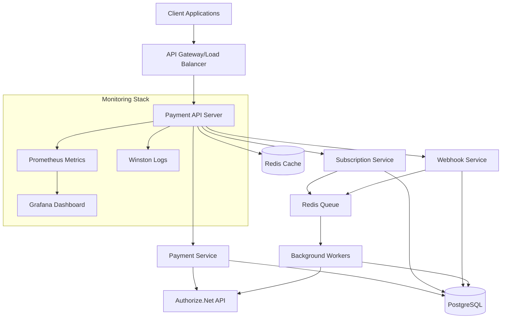
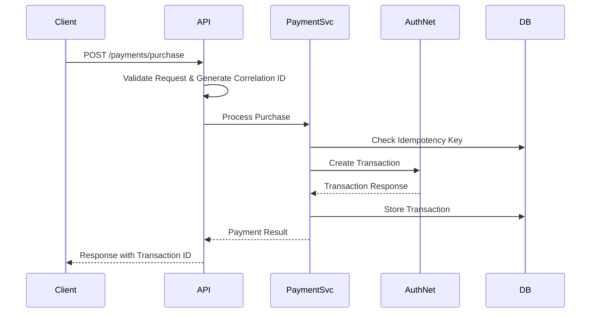
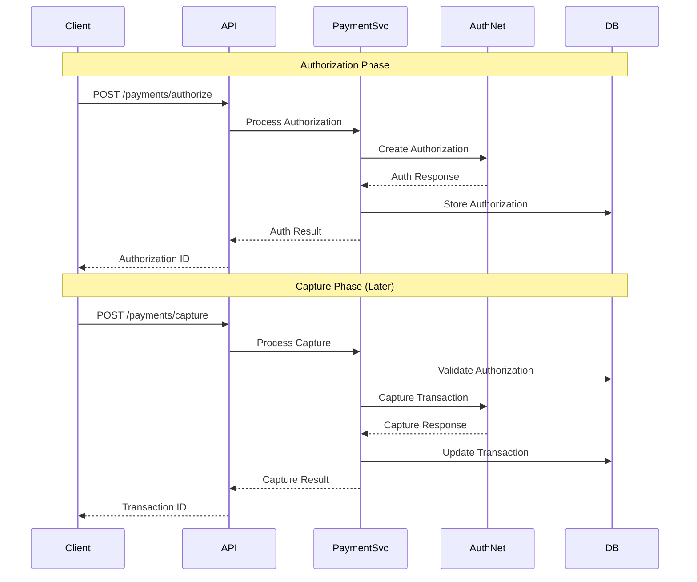
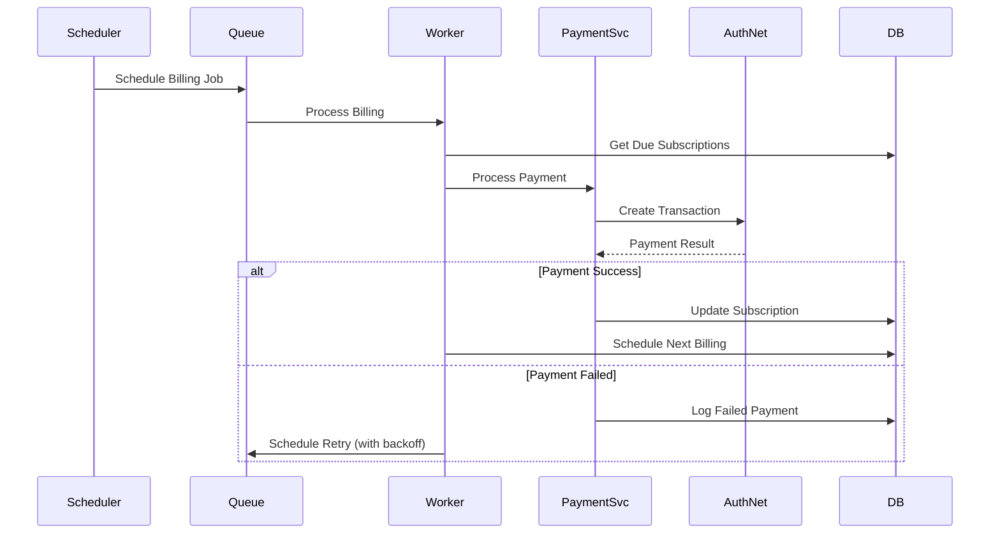
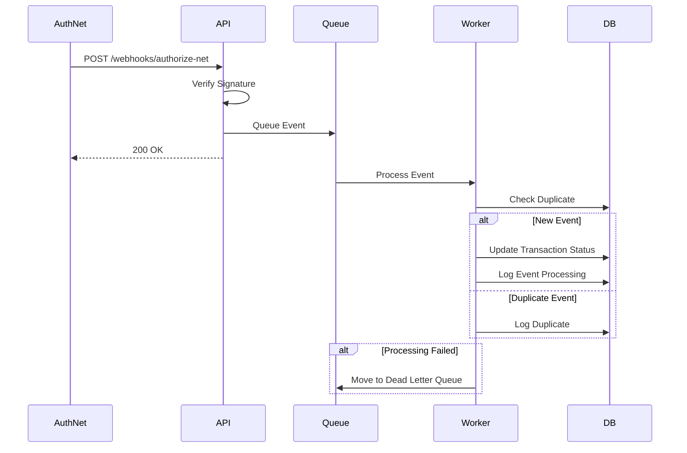
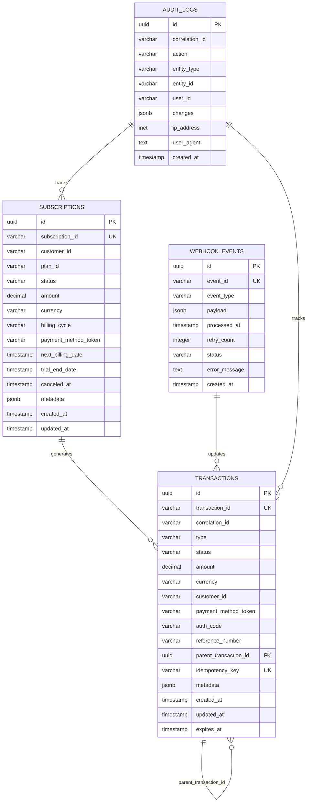

# System Architecture

This document provides a comprehensive overview of the Payment Backend Service architecture, including API endpoints, system flows, database schema, entity relationships, and key design decisions.

## 🏗️ High-Level Architecture



## 🔄 System Flows

### 1. Purchase Transaction Flow



### 2. Authorize + Capture Flow



### 3. Subscription Billing Flow



### 4. Webhook Processing Flow



## 🗄️ Database Schema

### Entity Relationship Diagram



### Database Indexes

```sql
-- Performance Indexes
CREATE INDEX idx_transactions_transaction_id ON transactions(transaction_id);
CREATE INDEX idx_transactions_correlation_id ON transactions(correlation_id);
CREATE INDEX idx_transactions_customer_id ON transactions(customer_id);
CREATE INDEX idx_transactions_status ON transactions(status);
CREATE INDEX idx_transactions_created_at ON transactions(created_at);
CREATE INDEX idx_transactions_idempotency_key ON transactions(idempotency_key);

CREATE INDEX idx_subscriptions_subscription_id ON subscriptions(subscription_id);
CREATE INDEX idx_subscriptions_customer_id ON subscriptions(customer_id);
CREATE INDEX idx_subscriptions_status ON subscriptions(status);
CREATE INDEX idx_subscriptions_next_billing_date ON subscriptions(next_billing_date);

CREATE INDEX idx_webhook_events_event_id ON webhook_events(event_id);
CREATE INDEX idx_webhook_events_event_type ON webhook_events(event_type);
CREATE INDEX idx_webhook_events_status ON webhook_events(status);
CREATE INDEX idx_webhook_events_created_at ON webhook_events(created_at);

CREATE INDEX idx_audit_logs_correlation_id ON audit_logs(correlation_id);
CREATE INDEX idx_audit_logs_entity_type_id ON audit_logs(entity_type, entity_id);
CREATE INDEX idx_audit_logs_created_at ON audit_logs(created_at);
```

## 🌐 API Endpoints Overview

### Payment Endpoints
| Method | Endpoint | Purpose | Authentication |
|--------|----------|---------|----------------|
| POST | `/api/v1/payments/purchase` | Single-step payment | API Key |
| POST | `/api/v1/payments/authorize` | Authorization hold | API Key |
| POST | `/api/v1/payments/capture` | Capture authorized payment | API Key |
| POST | `/api/v1/payments/refund` | Refund transaction | API Key |
| POST | `/api/v1/payments/cancel` | Cancel authorization | API Key |

### Subscription Endpoints
| Method | Endpoint | Purpose | Authentication |
|--------|----------|---------|----------------|
| POST | `/api/v1/subscriptions` | Create subscription | API Key |
| GET | `/api/v1/subscriptions/{id}` | Get subscription details | API Key |
| PUT | `/api/v1/subscriptions/{id}` | Update subscription | API Key |
| DELETE | `/api/v1/subscriptions/{id}` | Cancel subscription | API Key |

### System Endpoints
| Method | Endpoint | Purpose | Authentication |
|--------|----------|---------|----------------|
| GET | `/api/v1/health` | Health check | None |
| GET | `/api/v1/metrics` | Prometheus metrics | None |
| POST | `/api/v1/webhooks/authorize-net` | Webhook receiver | Signature |

## 🏛️ Design Trade-offs and Decisions

### 1. Synchronous vs Asynchronous Processing

#### Decision: Hybrid Approach
- **Synchronous**: Core payment operations (purchase, authorize, capture)
- **Asynchronous**: Webhook processing, subscription billing, retry logic

#### Rationale:
- **Real-time Response**: Payment operations need immediate feedback
- **Scalability**: Webhook processing can handle high volumes without blocking
- **Reliability**: Async processing allows for retry mechanisms and dead letter queues

#### Implementation:
```typescript
// Synchronous payment processing
app.post('/payments/purchase', async (req, res) => {
  const result = await paymentService.processPurchase(req.body);
  res.json(result); // Immediate response
});

// Asynchronous webhook processing
app.post('/webhooks/authorize-net', async (req, res) => {
  await webhookQueue.add('process-event', req.body);
  res.status(200).send('OK'); // Immediate acknowledgment
});
```

### 2. Database Transaction Strategy

#### Decision: Optimistic Locking with Idempotency Keys
- **Optimistic Locking**: Assume conflicts are rare, check at commit time
- **Idempotency Keys**: Prevent duplicate transactions at application level

#### Rationale:
- **Performance**: Better throughput than pessimistic locking
- **Reliability**: Idempotency keys ensure exactly-once processing
- **Scalability**: Reduces lock contention in high-concurrency scenarios

#### Implementation:
```typescript
async processPurchase(request: PurchaseRequest): Promise<TransactionResult> {
  // Check idempotency key first
  const existing = await this.transactionRepo.findByIdempotencyKey(
    request.idempotencyKey
  );
  if (existing) {
    return existing; // Return cached result
  }

  // Process with optimistic locking
  return await this.transactionRepo.transaction(async (manager) => {
    const transaction = await this.authorizeNet.createTransaction(request);
    return await manager.save(Transaction, transaction);
  });
}
```

### 3. Retry Strategy

#### Decision: Exponential Backoff with Circuit Breaker
- **Exponential Backoff**: Gradually increase retry intervals
- **Circuit Breaker**: Stop retrying after consecutive failures
- **Dead Letter Queue**: Handle permanently failed messages

#### Rationale:
- **Resilience**: Handle transient failures gracefully
- **Resource Protection**: Prevent overwhelming downstream services
- **Observability**: Failed messages are preserved for analysis

#### Implementation:
```typescript
const retryConfig = {
  attempts: 3,
  delay: (attemptNumber) => Math.pow(2, attemptNumber) * 1000, // 1s, 2s, 4s
  onFailedAttempt: (error) => {
    logger.warn(`Attempt ${error.attemptNumber} failed: ${error.message}`);
  }
};

// Circuit breaker configuration
const circuitBreaker = new CircuitBreaker(paymentService.processPayment, {
  timeout: 30000,
  errorThresholdPercentage: 50,
  resetTimeout: 60000
});
```

### 4. Data Encryption Strategy

#### Decision: Field-Level Encryption with Key Rotation
- **AES-256**: Industry standard encryption algorithm
- **Field-Level**: Encrypt only sensitive fields, not entire records
- **Key Rotation**: Support for periodic key rotation

#### Rationale:
- **PCI Compliance**: Meets data protection requirements
- **Performance**: Selective encryption minimizes overhead
- **Security**: Key rotation limits exposure window

#### Implementation:
```typescript
@Entity()
export class Transaction {
  @Column({ transformer: new EncryptionTransformer() })
  paymentMethodToken: string;

  @Column({ transformer: new EncryptionTransformer() })
  customerEmail: string;

  // Non-sensitive fields remain unencrypted
  @Column()
  amount: number;
}
```

### 5. Queue Architecture

#### Decision: Redis-Based Queue with Bull
- **Redis**: In-memory data structure store for queues
- **Bull**: Robust job queue library with retry logic
- **Multiple Queues**: Separate queues for different job types

#### Rationale:
- **Performance**: Redis provides fast queue operations
- **Reliability**: Bull handles job persistence and retry logic
- **Scalability**: Multiple workers can process jobs concurrently
- **Monitoring**: Built-in job monitoring and metrics

#### Implementation:
```typescript
// Queue definitions
const webhookQueue = new Queue('webhook processing', redisConfig);
const billingQueue = new Queue('subscription billing', redisConfig);

// Job processors
webhookQueue.process('process-event', 5, webhookProcessor);
billingQueue.process('process-billing', 3, billingProcessor);

// Job scheduling
await billingQueue.add('process-billing', 
  { subscriptionId }, 
  { delay: calculateNextBilling(subscription) }
);
```

## 🔒 Compliance Considerations

### PCI DSS Requirements

#### Data Storage
- **Never Store**: Full credit card numbers, CVV codes
- **Tokenization**: Use Authorize.Net payment tokens
- **Encryption**: AES-256 for sensitive data at rest
- **Access Control**: Role-based access to payment data

#### Network Security
- **TLS 1.3**: All communications encrypted in transit
- **Firewall**: Restrict access to payment processing systems
- **Network Segmentation**: Isolate payment processing environment

#### Monitoring and Logging
- **Audit Trail**: Log all payment operations
- **Access Monitoring**: Track all data access attempts
- **Anomaly Detection**: Monitor for suspicious activities
- **Log Protection**: Secure and tamper-evident logging

### Implementation Example:
```typescript
// PCI-compliant payment data handling
interface SecurePaymentData {
  // Safe to store
  cardLast4: string;
  cardType: string;
  paymentToken: string; // Authorize.Net token
  expiryMonth: string;
  expiryYear: string;
  
  // Never stored
  // cardNumber: NEVER
  // cvv: NEVER
}

// Audit logging for compliance
async auditPaymentOperation(operation: string, data: any) {
  await this.auditService.log({
    action: operation,
    entityType: 'payment',
    entityId: data.transactionId,
    userId: data.userId,
    ipAddress: data.ipAddress,
    changes: sanitizeForAudit(data), // Remove sensitive fields
    timestamp: new Date()
  });
}
```

## 📊 Performance Considerations

### Database Optimization
- **Connection Pooling**: 5-20 connections per instance
- **Query Optimization**: Proper indexing strategy
- **Read Replicas**: Separate read/write operations for scaling

### Caching Strategy
- **Redis Cache**: Payment tokens, customer data (30 min TTL)
- **Application Cache**: Configuration data, rate limit counters
- **CDN**: Static assets and documentation

### Monitoring Metrics
- **Response Time**: 95th percentile < 500ms
- **Throughput**: 1000+ transactions per minute
- **Error Rate**: < 0.5% for payment operations
- **Queue Processing**: < 30 seconds end-to-end

---

This architecture provides a robust, scalable, and compliant foundation for payment processing while maintaining flexibility for future enhancements and integrations.
